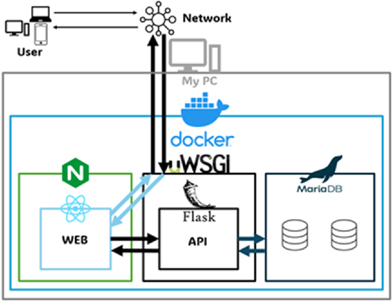

# なんでも歌えるカラオケアプリKalyoke
## どんなwebアプリ？

YouTubeのURLを入力するだけで、カラオケが歌えるようになるwebアプリです。
のプロジェクトはそれをDocker上で動作させるためのコンテナたちになっています。



## セットアップガイド

このガイドでは、プロジェクトのセットアップと環境の初期化手順について説明します。

### 必要条件

- システムにDocker及びDocker Composeがインストールされていること
- Dockerコンテナ内でnginxなどのサービスを管理するための`systemctl`（または代替コマンド）が利用可能であること

### セットアップ手順

#### 1. 環境変数の準備

プロジェクトのルートディレクトリに`.env`ファイルを作成し、以下の内容を必要に応じて調整して設定してください：

```plaintext
NODE_ENV=production
REACT_APP_HOST_URL=[YourDomain]
REACT_APP_API_URL=[YourDomain]

DB_ROOT_PASSWORD=[RootPass]
DB_NAME=[Name]
DB_USER=[User]
DB_PASSWORD=[Pass]
```

#### 2. uWSGIの設定

プロジェクトフォルダ（例：`/flask`）に`uwsgi.ini`設定ファイルを作成します。設定例：

```ini
[uwsgi]
chdir = /flask
wsgi-file = Connector.py
callable = app
master = true
```

パスとファイル名は、プロジェクト構造に合わせて適宜調整してください。

#### 3. コンテナの起動

全サービスを起動するには、以下のコマンドを実行します：

```bash
docker-compose up -d --build
```

#### 4. データベースのセットアップ

##### データベースコンテナへのアクセス
```bash
docker exec -it react-kalyoke-db bash
```

##### MariaDBへのログイン
```bash
mariadb -u root -p [RootPass]
```

##### データベーステーブルの作成

データベースを選択：
```sql
use [Name];
```

以下のSQLコマンドでテーブルを作成します：

```sql
CREATE TABLE videos (
    id INT NOT NULL AUTO_INCREMENT,
    site VARCHAR(255) NOT NULL,
    video_id VARCHAR(255) NOT NULL,
    title VARCHAR(255) NOT NULL,
    lyric TEXT NULL,
    folder_path VARCHAR(400) NOT NULL,
    register_date DATETIME NOT NULL,
    update_date DATETIME NOT NULL,
    PRIMARY KEY (id)
);

CREATE TABLE users (
    id INT NOT NULL AUTO_INCREMENT PRIMARY KEY,
    username VARCHAR(50) NOT NULL UNIQUE,
    email VARCHAR(255) NOT NULL UNIQUE,
    password VARCHAR(255) NOT NULL,
    status ENUM('temp', 'free', 'singer', 'himazi') NOT NULL,
    singed_count INT DEFAULT 0,
    token CHAR(64),
    singed_history JSON,
    created_at TIMESTAMP NOT NULL DEFAULT CURRENT_TIMESTAMP
);

CREATE TABLE api_usage_log (
    id INT AUTO_INCREMENT PRIMARY KEY,
    date DATE NOT NULL,
    reset_time TIME NOT NULL DEFAULT '17:00:00',
    endpoint VARCHAR(255) NOT NULL,
    usage_count INT DEFAULT 0,
    UNIQUE KEY unique_endpoint_date (date, endpoint)
);


INSERT INTO api_usage_log (date, reset_time, endpoint, usage_count)
VALUES (CURDATE(), '17:00:00', 'google_api', 1)
ON DUPLICATE KEY UPDATE usage_count = usage_count + 1;

CREATE EVENT IF NOT EXISTS reset_google_api_usage
ON SCHEDULE EVERY 1 DAY
STARTS CONCAT(CURDATE(), ' 17:00:00')
DO
BEGIN
    -- Google APIの使用回数をリセット
    UPDATE api_usage_log
    SET usage_count = 0
    WHERE endpoint = 'google_api' AND date = CURDATE();
END$$

SET GLOBAL event_scheduler = ON;

SHOW VARIABLES LIKE 'event_scheduler';


```

#### 5. 各種コンテナ操作用コマンド

##### 全サービスの起動
```bash
docker-compose up -d --build
```

##### react-kalyoke-webコンテナへのアクセス
```bash
docker exec -it react-kalyoke-web sh
```

##### Nginxの再起動
react-kalyoke-webコンテナ内で実行：
```bash
systemctl restart nginx
```

##### MariaDBの単独実行
```bash
cd db
docker build -t react-kalyoke-db .
docker run -d --rm --name react-kalyoke-db -v /db/db_data:/var/lib/mysql -p 3306:3306 react-kalyoke-db
```

##### コンテナ内のMariaDBへのアクセス
```bash
docker exec -it react-kalyoke-db bash
mariadb -u root -p
```